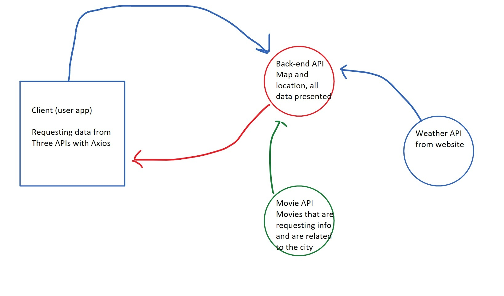

Project Name City Explorer
Author: Hanbyeol Lee: 1.0.0

Overview
This is a project for codefellows 301 class City Explorer Project

Getting Started
Architecture
Change Log
Credit and Collaborations
Time Estimates For each of the lab features, make an estimate of the time it will take you to complete the feature, and record your start and finish times for that feature:

Name of feature: USING API to get the live Data of the weather

Estimate of time needed to complete: 6 Hours

Start time: 1600

Finish time: 2200

Actual time needed to complete: 6 Hours

Completed API

